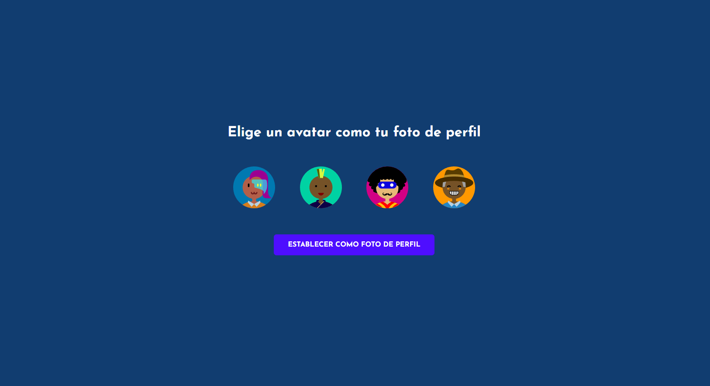

# 💬 Chat Online

[Español](README.md)  / [Inglés](README_EN.md) 

## 📖 Sobre el proyecto

Este proyecto es un **Chat Online** donde puedes registrarte, iniciar sesión e interactuar con otros usuarios, estén conectados o no. Utiliza un mecanismo sencillo para la comunicación entre el cliente y el servidor, garantizando una experiencia fluida y eficiente. ¡Espero que disfrutes usando este chat tanto como yo disfruté creándolo!

## 💻 Tecnologías usadas

- **Base de datos:** MongoDB
- **Frontend:** React
- **Backend:** Node.js
- **Comunicación en tiempo real:** Socket.io
- **Gestor de paquetes:** Yarn

## 🚀 ¿Cómo deployarlo?

### Clonar el repositorio

1. Clona el repositorio desde GitHub: `git clone https://github.com/DarioAlbor/ChatOnline.git`
2. Navega al directorio del proyecto: `cd ChatOnline`

### Configurar y arrancar el servidor

1. Navega al directorio del servidor: `cd server`
2. Modifica el archivo `.env` con tu configuración.
3. Instala las dependencias: `yarn`
4. Inicia el servidor: `yarn start`

### Configurar y arrancar el cliente

1. Navega al directorio del cliente: `cd client`
2. Instala las dependencias: `yarn`
3. Inicia el cliente: `yarn start`

¡Disfruta!

## 📬 Contacto

Puedes contactarme mediante mi [portafolio](https://darioalbor.dev.ar).

También puedes contribuir al proyecto sumando nuevas ideas o líneas de código. ¡Toda ayuda es bienvenida!

## 📸 Imágenes

|  |  |
|:--------------------------------------------:|:---------------------------------------:|
| Inicio de sesión                             | Registro                               |

|  |         |
|:--------------------------------------------:|:--------------------------------------:|
| Imagen de perfil                             | Chat                                   |
