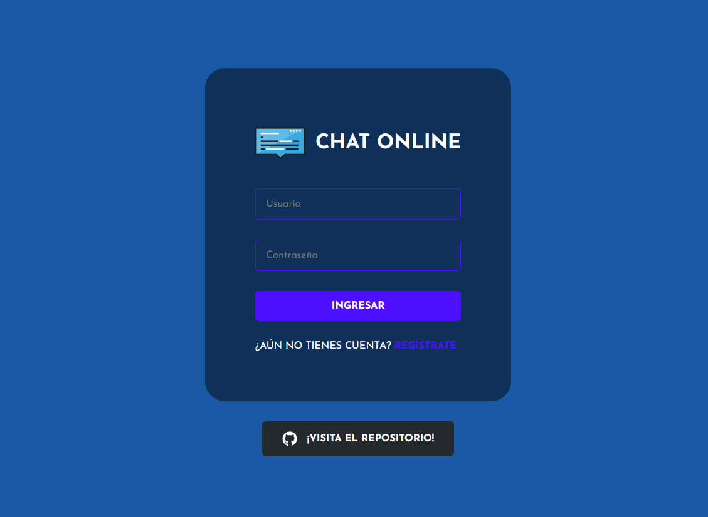
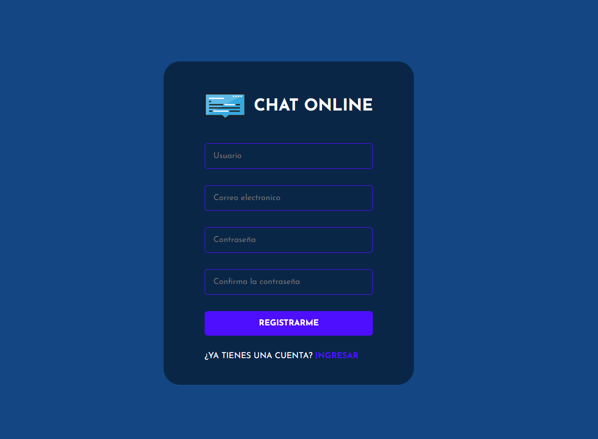
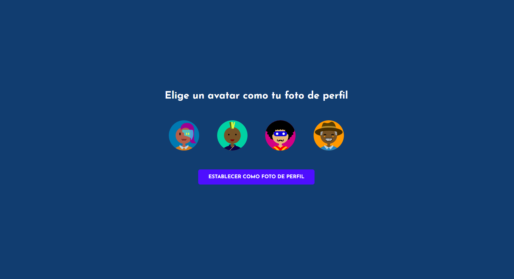
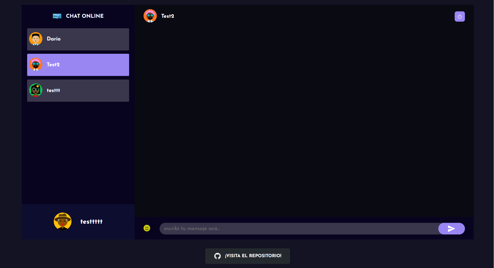

# 💬 Chat Online

[Spanish](README.md)  / [English](README_en.md) 

## 📖 About the project

This project is an **Online Chat** where you can register, log in, and interact with other users, whether they are online or not. It uses a simple mechanism for communication between the client and the server, ensuring a smooth and efficient experience. I hope you enjoy using this chat as much as I enjoyed creating it!

## 💻 Technologies used

- **Database:** MongoDB
- **Frontend:** React
- **Backend:** Node.js
- **Real-time communication:** Socket.io
- **Package manager:** Yarn

## 🚀 How to deploy it?

### Clone the repository

1. Clone the repository from GitHub: `git clone https://github.com/DarioAlbor/ChatOnline.git`
2. Navigate to the project directory: `cd ChatOnline`

### Set up and start the server

1. Navigate to the server directory: `cd server`
2. Modify the `.env` file with your configuration.
3. Install dependencies: `yarn`
4. Start the server: `yarn start`

### Set up and start the client

1. Navigate to the client directory: `cd client`
2. Install dependencies: `yarn`
3. Start the client: `yarn start`

Enjoy!

## 📬 Contact

You can contact me through my [portfolio](https://darioalbor.dev.ar).

You can also contribute to the project by adding new ideas or lines of code. All help is welcome!

## 📸 Images

|  |  |
|:---------------------------------:|:---------------------------------------:|
| Login                             | Register                                |

|  |         |
|:-----------------------------------:|:--------------------------------------:|
| Profile                            | Chat                                   |
